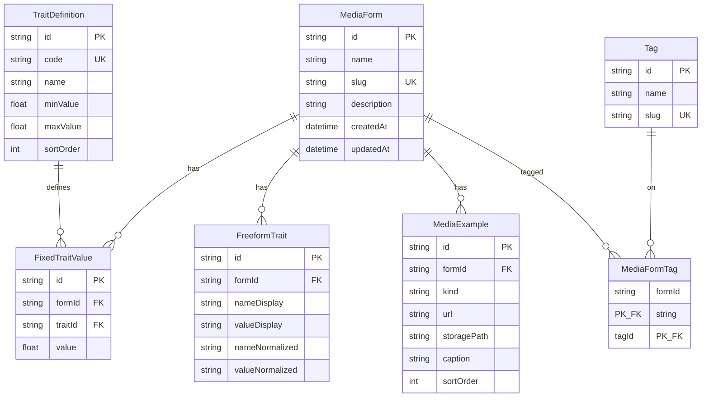

# Database structure

Canonical description of the Prisma / SQLite schema. **Source of truth for the schema code:** [`prisma/schema.prisma`](./prisma/schema.prisma). Keep this file in sync whenever that schema changes.

**Provider:** SQLite locally (`DATABASE_URL=file:./dev.db` under `prisma/`). Swap to Postgres for cloud with the same models.

---

## Entity relationship

---

## Tables

### `MediaForm`

A catalogued media form (e.g. Opera, Ukiyo-e).

| Column | Type | Notes |
|--------|------|--------|
| `id` | `String` | `cuid()`, PK |
| `name` | `String` | Display name |
| `slug` | `String` | Unique URL key |
| `description` | `String` | Default `""` |
| `createdAt` | `DateTime` | Default `now()` |
| `updatedAt` | `DateTime` | Auto-updated |

**Relations:** `fixedTraits`, `freeformTraits`, `examples`, `tags` (`MediaFormTag`).

---

### `Tag`

Filter-only label. Does **not** affect atlas proximity. Unused tags are pruned in app logic when forms are deleted or tags are reassigned.

| Column | Type | Notes |
|--------|------|--------|
| `id` | `String` | `cuid()`, PK |
| `name` | `String` | Display name |
| `slug` | `String` | Unique normalized key |

**Relations:** `forms` (`MediaFormTag`).

---

### `MediaFormTag`

Many-to-many join between forms and tags.

| Column | Type | Notes |
|--------|------|--------|
| `formId` | `String` | FK → `MediaForm`, part of composite PK |
| `tagId` | `String` | FK → `Tag`, part of composite PK |

**Constraints:** `@@id([formId, tagId])`. Cascade delete from form or tag.

---

### `TraitDefinition`

Fixed trait vocabulary (seeded: VIS, AUD, EMB, LIV, SEM, MAT, RAU, TMP).

| Column | Type | Notes |
|--------|------|--------|
| `id` | `String` | `cuid()`, PK |
| `code` | `String` | Unique short code |
| `name` | `String` | Display name |
| `minValue` | `Float` | Default `0` |
| `maxValue` | `Float` | Default `10` |
| `sortOrder` | `Int` | Default `0` |

**Relations:** `values` (`FixedTraitValue`).

---

### `FixedTraitValue`

Score of one form on one fixed trait.

| Column | Type | Notes |
|--------|------|--------|
| `id` | `String` | `cuid()`, PK |
| `formId` | `String` | FK → `MediaForm` |
| `traitId` | `String` | FK → `TraitDefinition` |
| `value` | `Float` | Score in trait range |

**Constraints:** `@@unique([formId, traitId])`. Cascade delete from form or trait.

---

### `FreeformTrait`

Custom name/value pair on a form. Matching uses normalized fields; display strings are shown in UI.

| Column | Type | Notes |
|--------|------|--------|
| `id` | `String` | `cuid()`, PK |
| `formId` | `String` | FK → `MediaForm` |
| `nameDisplay` | `String` | As entered |
| `valueDisplay` | `String` | As entered |
| `nameNormalized` | `String` | For matching |
| `valueNormalized` | `String` | For matching |

**Indexes:** `@@index([nameNormalized, valueNormalized])`. Cascade delete from form.

---

### `MediaExample`

Image or video example for a form (external URL and/or local upload path).

| Column | Type | Notes |
|--------|------|--------|
| `id` | `String` | `cuid()`, PK |
| `formId` | `String` | FK → `MediaForm` |
| `kind` | `String` | `image` \| `video` (app convention; not a DB enum) |
| `url` | `String?` | External URL |
| `storagePath` | `String?` | Uploaded file under `public/uploads` |
| `caption` | `String` | Default `""` |
| `sortOrder` | `Int` | Default `0` |

Cascade delete from form. Either `url` or `storagePath` is expected at the app layer.

---

## What is *not* stored

- Pairwise similarity / MDS layout — computed at read time ([`src/lib/similarity.ts`](./src/lib/similarity.ts)).
- Atlas view mode, selection, tag filter — UI / URL state only.
- Admin sessions — signed cookie (`jose`), not a user table.

---

## Seed expectations

[`prisma/seed.ts`](./prisma/seed.ts) resets catalog data and loads:

- 8 `TraitDefinition` rows  
- Sample `MediaForm` + `FixedTraitValue` (+ some freeform) from the reference spreadsheet  
- Demo `Tag` / `MediaFormTag` rows  

---

## Maintenance

When you change models, fields, indexes, or relations in `prisma/schema.prisma`:

1. Update this file (ER diagram + table sections) to match.  
2. Apply schema (`npm run db:push` or migrate) and adjust seed/API if needed.  
3. Do **not** treat [PLAN.md](./PLAN.md) as the live schema — it points here for structure.
